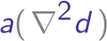

<h2 align="center">
    
</h2>

# A2D - a PDE discretization library using almost automatic differentiation

A toolkit for almost automatic differentiation of vector and matrix expressions.

This code relies heavily on the approach for deriving auto-diff expressions by
M. B. Giles, "Collected matrix derivative results for forward and reverse mode
AD".

# Usage

A2D is a header only c++ templated library. The only requirement for using A2D is a C++17 supported compiler.

To use A2D, include ```include/a2dcore.h```.

## Build tests and examples

Start from the root directory of a2d, do the following
```
mkdir build &&
cd build &&
cmake .. &&
make -j # parallel make using maximum number of processors
```

## Testing
Unit tests are implemented using [Google
Test](https://google.github.io/googletest/primer.html) framework, which is
automatically downloaded when building tests.

CTest (bundled with CMake) is used to execute tests, simply go to```<build
dir>/tests``` and execute
```
ctest
```
to run unit tests.

## Code format
```clangFormat``` is used as the auto-formatter, with style ```--style=Google```.
 If you would like to contribute to the project, please make sure you set up the
 auto-formatter accordingly.

